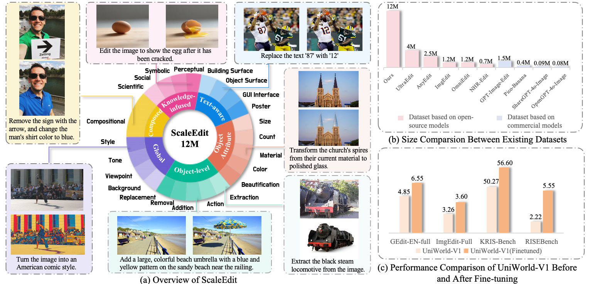
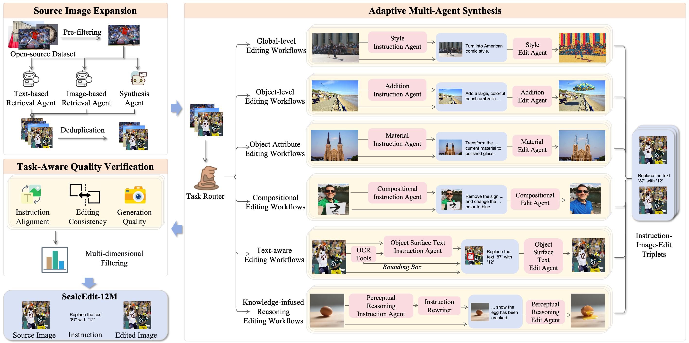

# ScaleEdit-12M: Scaling Open-Source Image Editing Data Generation via Multi-Agent Framework

<div align="center">

[](https://arxiv.org/abs/2603.20644)&nbsp;
[](https://github.com/gzchen4ai/ScaleEdit-12M)&nbsp;
[](https://huggingface.co/datasets/InternVL-U/ScaleEdit-12M)&nbsp;

</div>

## 📌 Overview
**The largest open-source instruction-based image editing dataset to date.**

ScaleEdit-12M contains **12.4 million** rigorously verified instruction–image pairs spanning **23 task families** across diverse real and synthetic visual domains. It was constructed using **ScaleEditor**, a fully open-source hierarchical multi-agent framework that eliminates the need for costly proprietary APIs.



## 🔥 News
- **[2026/04/03]** 🚀ScaleEdit-12M is released on [[Huggingface]](https://huggingface.co/datasets/InternVL-U/ScaleEdit-12M).
- **[2026/03/24]** 🔥ScaleEdit-12M paper is released on [[arXiv]](https://arxiv.org/abs/2603.20644). 
- **[2026/03/06]** 🔥InternVL-U **technical report** released.  Check it out on [[arXiv]](https://arxiv.org/abs/2603.09877). 

## ✅ TODO
- [x] Release ScaleEdit-12M dataset
- [ ] Release ScaleEdit-1M subset
- [ ] Release ScaleEditor framework

## 📊 Dataset Structure

### Repository Layout

The dataset is organized into **23 task-specific subdirectories**, each containing multiple sharded Parquet files. The directory naming follows the pattern `{category_id}_{task_name}`:

```
ScaleEdit-12M/
├── README.md
├── 1.1_style_transfer/                  # Global editing tasks
│   ├── style_transfer_0000.parquet      # (~31.7 GB per shard)
│   ├── style_transfer_0001.parquet
│   ├── ...
│   └── style_transfer_0015.parquet
├── 1.2_tone_adjustment/
│   └── tone_adjustment_XXXX.parquet
├── 1.3_viewpoint_transformation/
├── 1.4_background_replacement/
├── 2.1_object_addition/                 # Object editing tasks
├── 2.2_object_removal/
├── 2.3_object_replacement/
├── 2.4_action_editing/
├── 2.5_part_extraction/
├── 3.1_color_change/                    # Attribute editing tasks
├── 3.2_material_change/
├── 3.3_visual_beautification/
├── 3.4_count_change/
├── 3.5_size_change/
├── 4.1_movie_poster_text_editing/       # Text editing tasks
├── 4.2_gui_interface_text_editing/
├── 4.3_object_surface_text_editing/
├── 4.4_building_surface_text_editing/
├── 5.1_perceptual_reasoning/            # Knowledge-infused tasks
├── 5.2_symbolic_reasoning/
├── 5.3_social_reasoning/
├── 5.4_scientific_reasoning/
└── 6.1_compositional_editing/           # Compositional tasks
```

Each task folder contains **multiple Parquet shards** (typically ~31–32 GB each) named `{task_name}_{shard_index:04d}.parquet`. The number of shards varies by task depending on the volume of data in that category.

### Parquet Schema

Each Parquet file contains the following columns:

| Column | Type | Description |
|---|---|---|
| `id` | `int64` | Unique identifier for the sample |
| `edit_task` | `string` | Task category name (e.g., `"style_transfer"`, `"object_addition"`) |
| `edit_instruction` | `string` | Natural-language editing instruction |
| `source_image` | `binary` | Raw bytes of the source image (pre-edit) |
| `edited_image` | `binary` | Raw bytes of the edited image (post-edit) |
| `source_image_width` | `int64` | Width of the source image in pixels |
| `source_image_height` | `int64` | Height of the source image in pixels |
| `edited_image_width` | `int64` | Width of the edited image in pixels |
| `edited_image_height` | `int64` | Height of the edited image in pixels |
| `instruction_following_score` | `int64` | Quality score: how well the edit follows the instruction (1–3) |
| `editing_consistency_score` | `int64` | Quality score: consistency between source and edited images (1–3) |
| `generation_quality_score` | `int64` | Quality score: overall visual quality of the edited image (1–3) |

### Example Row

```json
{
    "id": 0,
    "edit_task": "object_addition",
    "edit_instruction": "Add a red and white striped safety barrier at the edge of the platform on the right side of the image.",
    "source_image": <binary bytes>,
    "edited_image": <binary bytes>,
    "source_image_width": 2000,
    "source_image_height": 1500,
    "edited_image_width": 2000,
    "edited_image_height": 1500,
    "instruction_following_score": 3,
    "editing_consistency_score": 3,
    "generation_quality_score": 3
}
```

The `source_image` and `edited_image` columns store images as raw binary bytes. They can be decoded into PIL images:

```python
from PIL import Image
import io

img = Image.open(io.BytesIO(row["source_image"]))
```

### Quality Scores

Every sample has been scored through ScaleEditor's **task-aware quality verification mechanism** across three dimensions, each rated on a 1–3 scale:

- **Instruction Following (IF, 1–3):** Does the edited image accurately reflect the intent of the instruction?
- **Editing Consistency (EC, 1–3):** Are unedited regions preserved? Is the edit spatially coherent with the source?
- **Generation Quality (GQ, 1–3):** Is the output image free of artifacts, distortions, and visual defects?

In ScaleEdit, only samples with IF=3, EC≥2, GQ≥2 are retained.

## 🛠️ Highlights

ScaleEdit-12M was constructed using the **ScaleEditor** framework, which consists of three stages:

1. **Source Image Expansion** — Curates and expands source images from diverse real and synthetic domains, infusing world knowledge to enable knowledge-grounded editing tasks.
2. **Adaptive Multi-Agent Editing** — An ensemble of specialized agents generates editing instructions and corresponding edited images, adapting strategies per task family.
3. **Task-Aware Quality Verification** — A multi-dimensional scoring system evaluates instruction following, editing consistency, and generation quality, filtering out low-quality samples.



Fine-tuning leading foundation models on ScaleEdit-12M yields consistent improvements:

- **Up to +10.4%** on ImgEdit and **+35.1%** on GEdit for general editing benchmarks
- **Up to +150.0%** on RISE and **+26.5%** on KRIS-Bench for knowledge-infused editing benchmarks

These gains were demonstrated on both UniWorld-V1 and Bagel, showing that open-source agentic pipelines can approach commercial-grade data quality.

## 🌟 Citation

```bibtex
@article{chen2026scaleedit,
  title={ScaleEdit-12M: Scaling Open-Source Image Editing Data Generation via Multi-Agent Framework},
  author={Chen, Guanzhou and Cui, Erfei and Tian, Changyao and Yang, Danni and Yang, Ganlin and Qiao, Yu and Li, Hongsheng and Luo, Gen and Zhang, Hongjie},
  journal={arXiv preprint arXiv:2603.20644},
  year={2026}
}
@article{tian2026internvl,
  title={InternVL-U: Democratizing Unified Multimodal Models for Understanding, Reasoning, Generation and Editing},
  author={Tian, Changyao and Yang, Danni and Chen, Guanzhou and Cui, Erfei and Wang, Zhaokai and Duan, Yuchen and Yin, Penghao and Chen, Sitao and Yang, Ganlin and Liu, Mingxin and others},
  journal={arXiv preprint arXiv:2603.09877},
  year={2026}
}
```